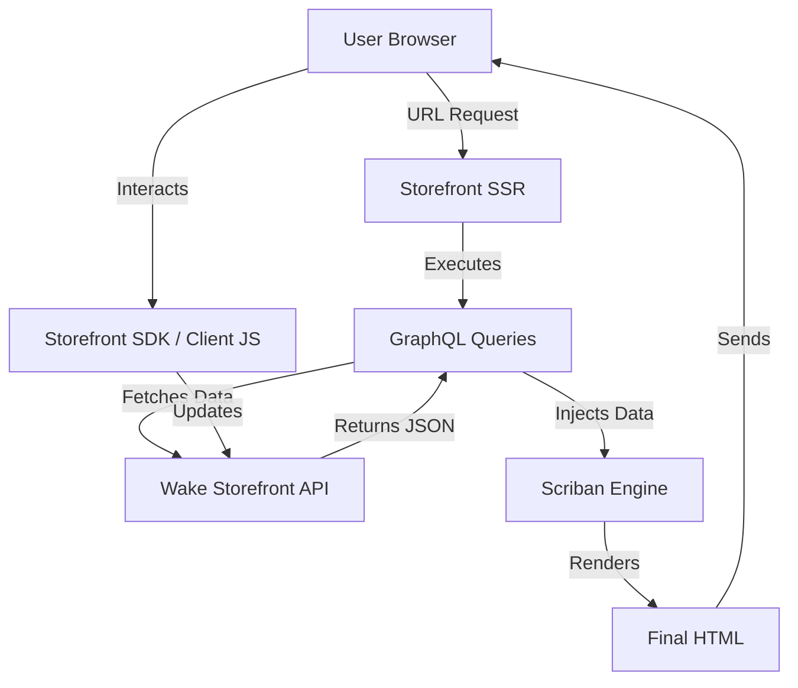

## Architecture Notes

This document describes the system architecture, design patterns, and key technical decisions for the Wake Commerce Storefront.

## System Architecture Overview

**Architecture Style**: Headless SSR (Server-Side Rendering)

The project follows a **Headless Commerce** architecture where the presentation layer (Storefront) is decoupled from the backend services (Wake Platform).

**Key Components**:
- **Storefront SSR**: A server-side environment that renders Scriban templates.
- **Wake Storefront API**: A GraphQL API that provides all the necessary data (Products, Categories, Cart, etc.).
- **Scriban Template Engine**: Used for server-side logic and HTML generation.
- **Client-Side JS**: Handles interactivity, cart operations, and dynamic updates via the Storefront SDK.

**Request Flow**:
1. A user requests a URL (e.g., `/home`).
2. The Storefront SSR receives the request and identifies the corresponding **Page** template.
3. The server executes the associated **GraphQL Query** to fetch data.
4. The data is injected into the **Scriban** context.
5. Scriban renders the HTML using **Components** and **Snippets**.
6. The final HTML (including Tailwind styles) is sent to the user's browser.

## Architectural Layers

- **Presentation (Scriban/HTML)**: `Pages/`, `Components/`, `Snippets/`
- **Data Fetching (GraphQL)**: `Queries/`
- **Configuration (JSON)**: `Configs/`
- **Styles (TailwindCSS)**: `Assets/CSS/`
- **Client Logic (JS)**: `Assets/JS/`

## Detected Design Patterns

| Pattern | Locations | Description |
|---------|-----------|-------------|
| **Component-Based UI** | `Components/` | Reusable UI blocks (e.g., `spot.html`, `header.html`). |
| **BFF (Backend for Frontend)** | `Queries/` | GraphQL queries tailored specifically for storefront needs. |
| **SSR (Server-Side Rendering)** | Platform | Content is rendered on the server for SEO and performance. |

## External Service Dependencies

- **Wake Commerce Platform**: The core engine for products, inventory, and checkout.
- **Wake Storefront API**: GraphQL endpoint for data retrieval.
- **CDN (static.fbits.net)**: Hosts shared assets like the Storefront SDK.

## Key Decisions & Trade-offs

- **Scriban vs. Client-Side Framework**: Scriban is used for SEO-critical rendering, while Vanilla JS/Tailwind handles interactivity. This minimizes the "Hydration" cost.
- **GraphQL**: Allows fetching exactly what's needed for each component, reducing payload size.
- **TailwindCSS**: Chosen for rapid styling and small final CSS footprint.

## Request/Data Flow Diagram

## Related Resources

- [Project Overview](./project-overview.md)
- [Tooling](./tooling.md)
- [codebase-map.json](./codebase-map.json)
